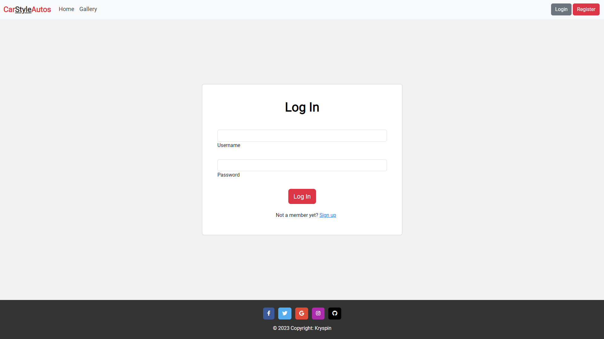

# CarStyleAutos #

* Here I have made a blog web application called - CarStyleAutos. It is a blog website aimed at a community of car enthusiasts that would like to share and  interact with others about certain cars/builds, share ideas. 

The live version of the website is available for you here : <a href="https://carstyleautos-blog.herokuapp.com">CarStyleAutos</a>

# README CONTENTS # 

* ## [UX](#ux-1)
   * [User Stories](#user-stories)
   * [Agile Methodologies](#agile-methodologies)
   * [The Scope](#1-scope)
   * [Structure](#2-structure)
   * [Skeleton](#3-skeleton)
   * [Surface](#4-surface)

* ## [Features](#features)
    * [User Registration and Login](#user-registration-and-login)
    * [Car Gallery](#car-gallery)
    * [Commenting System](#commenting-system)
    * [Responsive Design](#responsive-design)
    * [Navigation Menu](#navigation-menu)
    * [User Authorization and Authentication](#user-authentication-and-authorization)

* ## [Deployment](#deployment-1)
    * [Heroku Service](#herokucom-service)
    * [Final Steps](#final-steps)

* ## [Technologies Used]()
    * [Languages Used](#languages)
    * [Frameworks / Libraries](#frameworks--libraries--programs)

* ## [Credits](#credits-1)

# UX #

## User Stories ##

  * As the site owner I want : 
  
    * A visually appealing and professional looking website to attract users
    * A simple and intuitive user interface that is easy to navigate
    * The ability to manage user accounts and access
    * The ability to manage and moderate user-generated content
    * A responsive design that works well on variety of devices
    * A way to communicate with users and provide support when neccessary

  * As the user, I would want : 

    * The ability to create an account and manage my posts
    * An easy and efficient way to browse the content
    * The ability to post and share my own content with the community
    * The ability to like, comment and interact with other users content
    * A responsive and user-friendly design that works well on any device

    

## Agile Methodologies ##

The agile methodology approach was used here when creating my CarStyleAutos web application.
I have achieved this by using the built in features of GitHub by creating a table of issues as well as the project to track the to-do list, and move them onto finished as I progressed with the sites features. 

The User-Stories were marked with the features that would be a : 
- Must have
- Could Add

The application still being in progress, will have features added in the future with constant progression towards a fully completed application with a ton of features for the users to interact with.

## 1. Scope ## 

The website here aims to provide a platform for car enthusiasts to share their knowledge and passion for cars with a community of like-minded individuals. Users will be able to register an account, create posts, like and comment on other posts, and interact with other members of the community. The website will be simple and user-friendly, with a focus on providing a visually appealing and responsive design.

## 2. Structure ##

* Home Page - a landing page that provides an overview of the website and its features
* Register Page - a page where users can create a new account by providing their name, email address and a password.
* Login Page - a page where users can log in to their account using their email address and password
* Gallery Page -  a page where users can view all car posts that have been posted by the community
* My Posts Page - a page where the user can manage/delete/edit or view their posts.
* Add Post Page - a page where the user can add their post to the gallery on CarStyleAutos 
* Edit Post Page - a page where the user can edit their currently posted car

## 3. Skeleton ##

Here is a basic wireframe of the website's layout : 

Here is the database schema for the project : 

## 4. Surface ## 

The design of CarStyleAutos is clean and modern, with a focus on readability and ease of use. The color scheme consists primarily of black,white, shades of gray, with red accents used sparingly for emphasis.

### Colors -
* The primary color used in the site is #333 for text, with red (#dc3545) used sparingly for emphasis. The following other colors are used :

  * #f2f2f2: background color for body
  * #fff: background color for navbar, modal and footer
  * #dc3545: primary red color for buttons and text
  * #333: primary text color
  * #000000: shadow color for text
  * #ddd: lighter shade of light gray color
  * #eee: light gray color for button backgrounds
  * #c82333: darker shade of primary red color

### Layout -

The layout of CarStyleAutos is responsive and adapts well to different screen sizes. Bootstrap being used here provides that functionality. The navbar is fixed at the top of the screen and is always visible, with the site logo and navigation linkes centered and spread between. The Hero section uses a large background image with a gradient overlay, with a centered heading and subheading along with a Join Us button. Cards are used throughout the site to display content, such as car images , posts previews and forms. Modals are used for login/logout functionalities as well as other forms such as Adding a post and Deleting it.
The footer is fixed always to the bottom of the screen containing the site information and social media links.

# Features #

## User registration and login :
- Users can create an account to access member-only features and log in to access their account in the future.

## Car Gallery :
 - A collection of posts of different types of cars. Users can view these images, leave comments and like the post/comments.
 
## User Posts :
 - Each user can create, edit and delete their own posts that appear on the site for others to see.
 
## Commenting system : 
- Users can leave comments on posts made by other users.
 
## Responsive design : 
- The site is designed to work on variety of devices and screen sizes.

## Navigation menu :
- A menu at the top of the page allows users to easily navigate between different pages on the site.

## User authentication and authorization: 
- The site ensures that only authorized users can access certain features or pages.

# Testing # 

 * I have created a seperate markdown documentation for the testing of this project. 

 - You can view the testing here : [Testing.MD](./TESTING.md)

 

# Deployment #

* ## Heroku.com Service ##

  * Here we log in or create an account to begin with.
  * On the dashboard view click 'Create New App' from the dropdown menu
  * Choose your app-name and region
  * Setup the CONFIG_VARS in the Settings tab in your project. 
      * SECRET_KEY
      * DATABASE_URL
      * CLOUDINARY_URL

      These three url's are to be set up and configured in your project.
      These connect your Database , Cloudinary and your Django Enviroment Key.
  * In the buildpack section in the settings tab add Python , then save changes.
  * Last but not least Link your project under the Deploy tab by selecting it from your github repository.

* ## Final Steps #

  * Make sure your settings.py option DEBUG = True is set to FALSE.
  * Ensure you have your Procfile created with the following code :
      * web: gunicorn carstyleautos.wsgi

* You can find the deployed version of the website here : <a href="https://carstyleautos-blog.herokuapp.com" target="_blank">CarStyleAutos</a>

# Technologies Used #

* ## Languages ##
  * HTML
  * CSS
  * Python
  * JavaScript

* ## Frameworks / Libraries / Programs ##
  * <a href="https://www.djangoproject.com/">Django (Python web Framework)</a> 
  * <a href="https://jquery.com/">jQuery (Javascript Library)</a>
  * <a href="https://getbootstrap.com/">Bootstrap (Front-End Library)</a>
  * <a href="https://django-crispy-forms.readthedocs.io/en/latest/">Django-Crispy-Forms (Django Form Rendering Library)</a>
  * <a href="https://pypi.org/project/psycopg2/">Psycopg2-Binary(PostgreSQL database adapter for Python)</a>
  * <a href="https://balsamiq.com/wireframes/?gclid=CjwKCAjw0N6hBhAUEiwAXab-TS4-B3FwE_NpeSWRL6jqqSJMnuxinyknl1t_ddtaW_Jd3UAOvbxguhoC4agQAvD_BwE">Balsamiq Wireframes(Wireframe Software to sketch initial design)</a>
  * <a href="https://github.com/">GitHub (Version Control alongside a Local Development Enviroment)</a>
  * <a href="https://fontawesome.com/">Font Awesome (Library of Icons)</a>
  * <a href="https://www.elephantsql.com/">ElephantSQL (Hosting service for the database for this application)</a>
  * <a href="https://cloudinary.com/?&utm_campaign=1329&utm_content=instapagelogocta-selfservetest">Cloudinary (Cloud based storage for all media files)</a>
  * <a href="https://heroku.com/">Heroku (Application hosting service)</a>
  * <a href="https://www.lucidchart.com/pages/">Lucidchart (Online Application for Flowcharts/Diagrams)</a>

# Credits #

### Coding ###

* <a href="https://google.com">Google</a>
* <a href="https://ui.dev/amiresponsive">AMI Responsive</a>
* <a href="https://stackoverflow.com/">Stack Overflow</a>
* <a href="https://youtube.com">YouTube</a>
* <a href="https://w3schools.com">W3Schools</a>
* <a href="https://https://codeinstitute.net/">Code Institute</a>
* <a href="https://getbootstrap.com/docs/5.3/getting-started/introduction/">Boostrap Documentations</a>

* All those resources were very valuable in the progression of my project whenever I was stuck at any point in time I refered back to the course material as well as the online resources.

* All my images were sourced from google images, and any copyrights are reserved for the owners as these are just for display purposes only.

### I would like to thank Code Institute for supplying me with the necessary guidance for this project. And Tutor support for certain things I was completely stuck at.

[def]: #credits