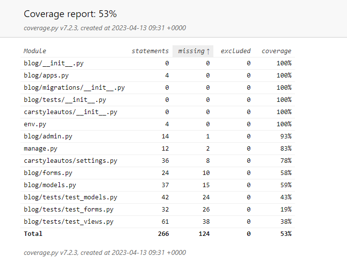

# Testing Documentation - CarStyleAutos

## TESTING.MD Contents

* [Coverage Resutlts](#Coverage)
* [CSS Validator](#CSS-Validator)
* [HTML Validator](#HTML-Validator)
* [Python Validator](#Python-Validator)
* [Lighthouse Results](#Lighthouse-Results)

## Automated Testing - Coverage

 * Here I covered a 67% coverage over my tests. I do know the industry standard is to aim above 80% in automated testing but due to time constraints that's currently what I've been able to cover. My aim is to hit above the 90% mark in the future.

 ## Manual Testing 

 * HTML Validator - 

 ![ScreenShot]
