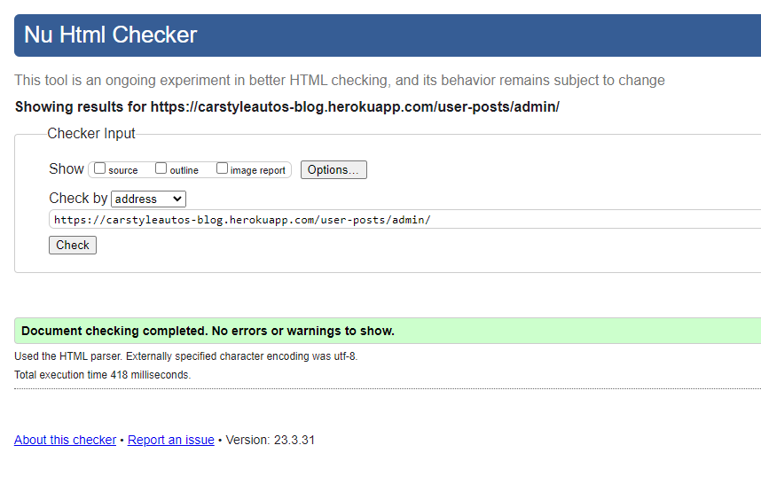

# Testing Documentation - CarStyleAutos

## TESTING.MD Contents

* [Coverage Resutlts](#automated-testing---coverage)
* [CSS Validator](#css-validator-w3c)
* [HTML Validator](#html-validator-w3c)
* [Python Validator](#python-pep8-validator)
* [Lighthouse Results](#lighthouse-performance-report)
* [Bugs/Issues](#bugs--issues)

## Automated Testing - Coverage

 * Here I covered a 53% coverage over my tests. I do know the industry standard is to aim above 80% in automated testing but due to time constraints that's currently what I've been able to cover. My aim is to hit above the 90% mark in the future.

 # Manual Testing 

 ## HTML Validator W3C :

- Home Page :

 

- Car Gallery Page :

- My Posts Page :

- Login Form Page :

- Register Form Page :

## CSS Validator W3C :

- CSS passes with no issues.

## Python PEP8 Validator :

Here I have snippets of the python files admin,apps, forms, models , urls and views 
which are all okay.

- Admin.py : 

- Forms.py :

- Models.py :

- Urls.py :

- Views.py :

# Lighthouse Performance Report

Here I performed the Lighthouse test on both a desktop application and mobile application.
Here are the results of both.

- Desktop : 

- Mobile : 

- I did notice it looks like there is a performance effect on the mobile version which I will tackle in optimising to it's best.

# Bugs / Issues

## Form Display :

- I did notice when the car post is being edited, under the image field the name of the file is displayed twice. This is something that I have to look into more as it throws off the aesthetic.

## Image Loading Time :

- I noticed that whenever I get into my Posts or gallery page, the page tend to loads a bit longer than usual. If car posts are going to be added in with high resolutions it will affect the performance negatively. Image caching or only allowing of certain formats will have to most likely be implemented to lower the loading times.

## Admin Logout :

- There seems to be an issue when logging out as admin in the administration panel , the page will throw up a Server Error 500 instead of bringing me back to the home page. Loading back into the home page then is fine and can just log in then as normal. Unusual behaviour and will have to be looked into further.

